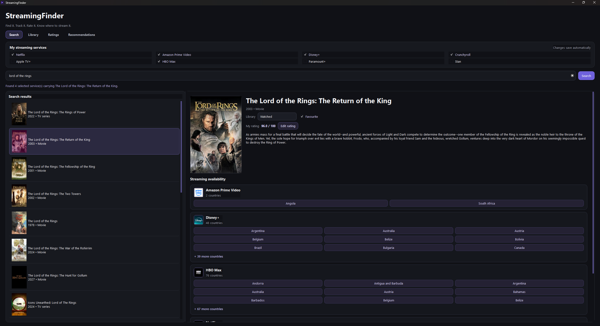
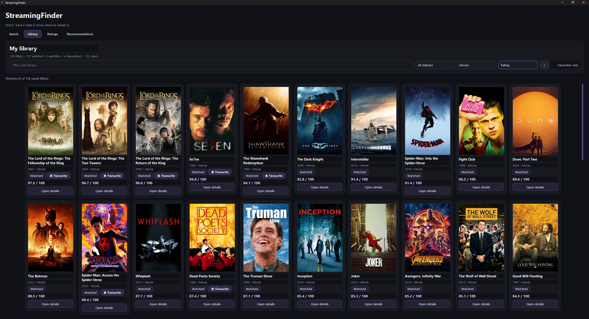
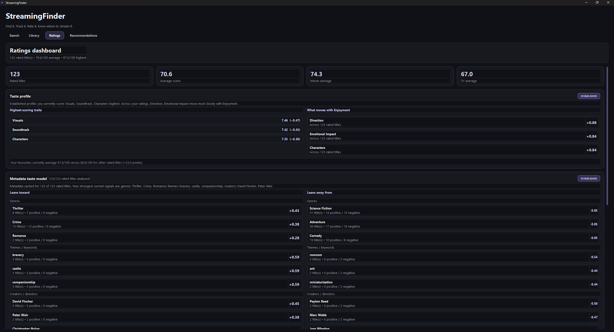
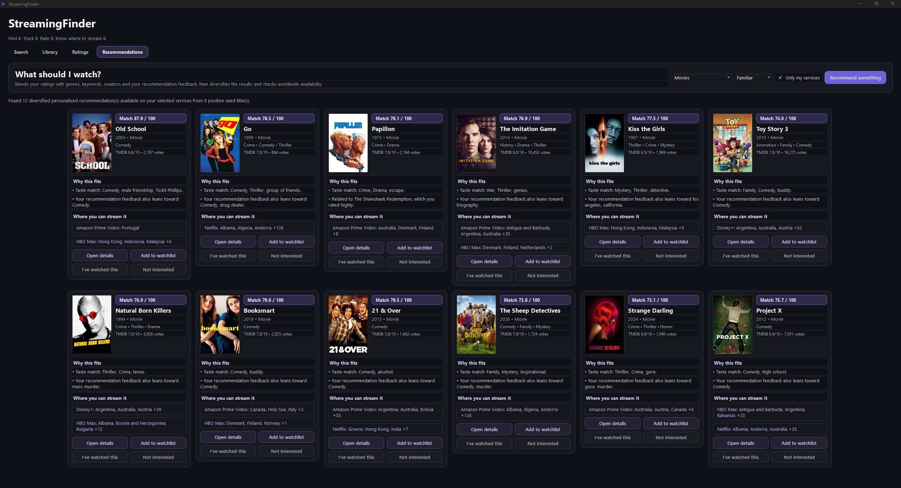

<p align="center">
  
</p>

<h1 align="center">StreamingFinder</h1>

<p align="center">
  <strong>Find where to watch. Track what you've seen. Discover what to watch next.</strong>
</p>

<p align="center">
  Windows desktop application · Python · PySide6 · FastAPI · SQLite · TMDB
</p>

**StreamingFinder v1.0.0** is a personal media discovery and tracking application. It combines worldwide streaming availability with a local movie, TV and anime library, detailed ratings, and a personalised recommendation engine that explains its suggestions.

Select your streaming subscriptions, look up availability across countries (including regions you might access with a VPN), keep track of what you've watched, and discover titles based on your own ratings rather than a generic popularity list.

> StreamingFinder shows provider availability; it does not stream content or provide a VPN. Availability can change and should be checked with the streaming provider before watching.

## Features

| | Capability | What it does |
|---|---|---|
| 🌍 | **Worldwide streaming discovery** | Search movies and TV shows and see which supported services list them across different countries. Filter results to your saved subscriptions. |
| 📚 | **Personal media library** | Organise titles as Watchlist, Watching, Watched or Dropped, with a separate Favourite toggle. Filter movies, live-action TV and anime, and sort by rating, release year, title or date added in either direction. |
| ⭐ | **Structured ratings** | Score titles across ten categories for a total out of 100, with optional personal notes. |
| 📊 | **Taste analysis** | Explore rating trends, category averages, enjoyment correlations and affinities for genres, themes and creators. |
| 🎬 | **Personalised recommendations** | Discover movies, live-action series, anime series and anime films using your ratings, saved preferences and feedback. |
| 🔄 | **Recommendation feedback** | Add a suggestion to your watchlist, mark it watched or dismiss it. Feedback persists and informs future suggestions. |
| 🖥️ | **Installed Windows app** | Launch from a Desktop or Start Menu shortcut without opening VS Code or a terminal. |
| 🔌 | **Local API** | An embedded FastAPI service provides structured access to availability, your library, ratings, recommendations and an assistant-facing interface. |

### A rating system built around your own taste

Every title can receive a score in **ten categories**: Story, Characters, Dialogue, Visuals, Soundtrack, Worldbuilding, Direction, Pacing, Emotional Impact and Enjoyment. These combine into a total score out of 100. Enjoyment is kept separate so something can be entertaining without necessarily receiving high scores in every other category.

The recommendation engine uses your rating history, TMDB metadata and recommendation feedback. Choose **Familiar**, **Balanced** or **Hidden gems** discovery, and inspect the reasons behind individual suggestions. Match scores are ranking signals, **not predictions or probabilities** of how much you'll enjoy a title.

## Application screenshots

### Streaming discovery

Find movies and TV shows, then compare streaming availability across countries and your selected services.



### Personal library

Track watched titles and your watchlist, filter media types, and reverse the sort order to browse your collection your way.



### Ratings and taste analysis

Rate titles across ten categories and explore your personal viewing preferences.



### Personalised recommendations

Discover films and series based on your ratings, metadata preferences and recommendation feedback.



## Getting started

### Requirements

- Windows and Python **3.12+** to build or run the application from source.
- A [TMDB](https://www.themoviedb.org/) API **read access token** for online search, metadata and streaming availability.
- PowerShell for the included build and installation scripts.

The installed application itself does **not** need VS Code or an activated Python environment to launch.

### 1. Set up the project

Clone or download this repository, open PowerShell in the project directory, then run:

```powershell
py -3.12 -m venv .venv
Set-ExecutionPolicy -Scope Process -ExecutionPolicy Bypass
.\.venv\Scripts\Activate.ps1
python -m pip install -e ".[dev,build]"
Copy-Item .env.example .env
```

Edit `.env` and set your own TMDB token:

```dotenv
TMDB_READ_ACCESS_TOKEN=your_tmdb_read_access_token
```

**Never commit your `.env` file or personal SQLite database.**

### 2. Build and install the Windows app

With the virtual environment active:

```powershell
.\scripts\install_windows.ps1
```

The script installs build dependencies, runs the tests, packages the application with PyInstaller, and creates **Desktop and Start Menu shortcuts**.

Once installed, launch **StreamingFinder** from either shortcut. The app starts its local API in the background, so no separate Uvicorn terminal is required for normal use.

> Building from source creates a PyInstaller application directory at `dist\StreamingFinder`. If distributing the Windows build, package the **whole directory**, not `StreamingFinder.exe` on its own.

### Data and updates

| Location | Purpose |
|---|---|
| `%LOCALAPPDATA%\Programs\StreamingFinder` | Installed application and bundled runtime files |
| `%LOCALAPPDATA%\StreamingFinder\.env` | Installed TMDB configuration |
| `%LOCALAPPDATA%\StreamingFinder\streaming_finder.db` | Installed library, ratings, preferences and recommendation feedback |

On first installation, the script copies an existing project `.env` and `data\streaming_finder.db` into AppData **only if the corresponding AppData file doesn't already exist**. Later reinstalls preserve existing AppData files. Back up your database before making major changes or reinstalling on another PC.

To uninstall while **keeping** your data:

```powershell
.\scripts\uninstall_windows.ps1
```

To uninstall and **also delete** your local data and configuration:

```powershell
.\scripts\uninstall_windows.ps1 -RemoveData
```

## Development

Run the desktop application directly from source:

```powershell
python -m app.desktop
```

Alternatively, run the FastAPI server separately during API development:

```powershell
uvicorn app.main:app --reload
```

Explore the interactive API documentation at **http://127.0.0.1:8000/docs** while the API is running. Don't start a second copy on the same port if the desktop app has already started the embedded server.

Run the automated test suite:

```powershell
python -m pytest
```

### API overview

The API exposes search, streaming availability, library management, ratings, taste analysis, recommendations and recommendation feedback. Some representative endpoints:

```text
GET /api/v1/search?query=Interstellar
GET /api/v1/availability/movie/157336?my_services=true
GET /api/v1/library
GET /api/v1/ratings/dashboard
GET /api/v1/ratings/taste-profile
GET /api/v1/ratings/metadata-profile
GET /api/v1/recommendations
GET /api/v1/recommendation-feedback/summary
```

An assistant-oriented interface also provides:

```text
GET /api/v1/assistant/where-to-watch?query=Interstellar
GET /api/v1/assistant/title-context?query=Interstellar
GET /api/v1/assistant/recommendations?media_type=movie&limit=5
GET /api/v1/assistant/profile
```

These endpoints are designed for future integration with **Mairon**, a separate personal assistant project. The API currently listens on **`127.0.0.1:8000` while the Windows app is open**, so remote/Raspberry Pi access and an always-on backend are **not part of this standalone v1.0 release**. See [the Mairon integration contract](docs/MAIRON_INTEGRATION.md) for the proposed tool mappings.

## Technology

- **Python 3.12** — application and recommendation logic
- **PySide6 / Qt** — native desktop interface
- **FastAPI + Uvicorn** — local API and assistant integration layer
- **SQLite** — local preferences, library, ratings, metadata cache and recommendation feedback
- **TMDB API** — title search, metadata and streaming-provider availability
- **PyInstaller + PowerShell** — Windows packaging and installation
- **pytest** — automated tests

## Project structure

```text
StreamingFinder/
├── app/                         # Desktop app, API, business logic and persistence
├── assets/                      # Application icon and image assets
├── docs/
│   ├── MAIRON_INTEGRATION.md    # Proposed assistant-facing tool contract
│   └── screenshots/             # Search, library, ratings and recommendations screenshots
├── scripts/                     # Windows build, install and uninstall scripts
├── tests/                       # Automated tests
├── pyproject.toml               # Python dependencies and project version
└── streaming_finder.spec        # PyInstaller packaging configuration
```

## Data sources and attribution

Movie and TV metadata and streaming-provider availability are obtained using [The Movie Database (TMDB)](https://www.themoviedb.org/). TMDB's watch-provider data uses JustWatch; streaming-provider information may vary by location and over time. StreamingFinder is an independent personal project and is **not affiliated with TMDB, JustWatch or the streaming providers**.

StreamingFinder is a discovery and personal tracking tool; it does not host or play copyrighted media.
